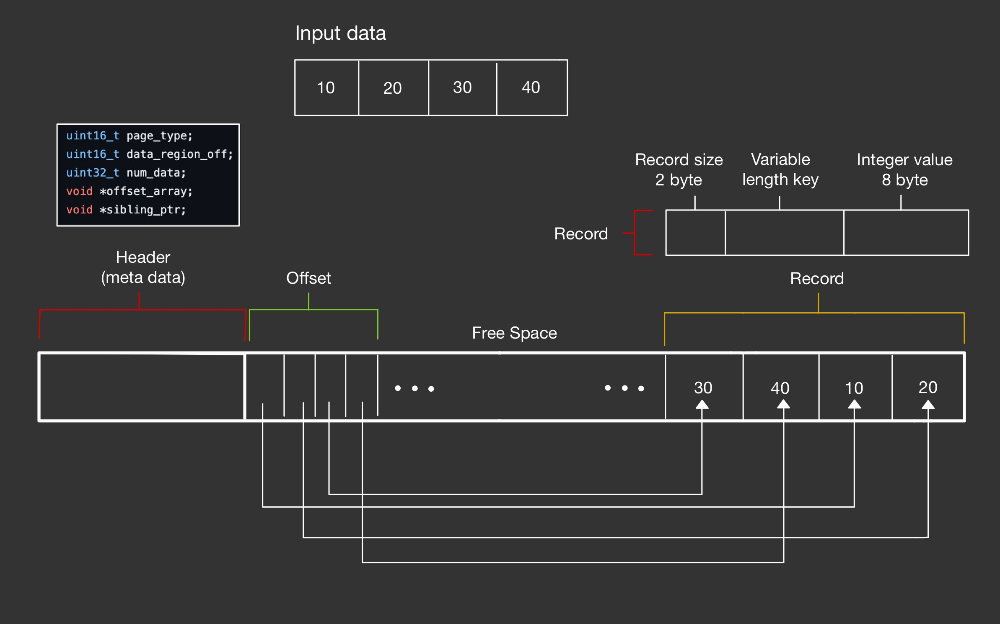

# B+ Tree with Slotted Page

implementation of Data Storage Structure using B+ Tree (with Slotted Page)

Assignment for Konkuk University, 'DataBase' class 2024,  professor Wook-Hee Kim

 

## Introduction

Each data is composed of key-value pair and saved in slotted page as a record. 
Each slotted page is a node in B+ Tree. 

 
 

## Slotted Page

Above picture is structure of slotted page what I implemented.

slotted page is saving structure for variable length data record. 

slotted page is composed of 3 main area.
1. header
2. offset
3. record

There is free space between offset and record. Offset is grow up to right direction and record is opposite.

I implemented only Insert, Search function for assignment :(

### 1. Header 
Metadata of slotted page. __Page_type__ is type in B+ Tree. There is two type in page_type. (LEAF, INTERNEL) __Data_region_off__ is pointer that next record will be stored. __Num_data__ is number of data is stored. __Offset_array__ is starting address of offset. __Sibling_ptr__ is pointer that is end of slotted page, but not use in this project.

### 2. Offset
Sorted pointer array for record. Offset must be sorted. but record doesn't have to.

### 3. Record
Each record is composed of 3 parts. At the begin, there is Record size info, 2 Bytes. Next, variable length key is saved. Last, value is saved. Value size is 8 Bytes, type is Integer. (in this project, we suppose that data is key-value type and value type is Integer only)

## B+ Tree

Above picture is B+ Tree structure what I implemented.

I implemented only Insert, Search function for assignment :(

Each node in B+ tree is slotted page what I implemented above. In internel node, key is sparse index of child node, and value is pointer of child node. In leaf node, key and value is pair of data that we want to save.

 

### Search
Because key is sorted, I compare search key and key of node. If my key is smaller than key of node, move to left pointer(pointer from previous key. If key is first one, leftmost ptr is located end of slotted page), and my key is bigger than key of node, move to right pointer (pointer from current key).

### Insert 
I find where data will be save using Search function. But if there is no space to save in slotted page, I split the page and redistribute the data. So that change is transmitted from leaf to root while there is no space to saved. 

Detail action in B+ tree followed action of general B+ tree in google.

 

## Things I regret

1. Because of assignment deadline, I implemented this project ***without following The Clean Code law***. All function and variable is named without representing own role. And all logic is implemented in one file. (page.cpp && btree.cpp) I will do  refactoring someday.

2. I implemented only Insert, Search function. I think ***Delete function is important as much as Insert function***. I will implement Delete functinon addtional someday.

